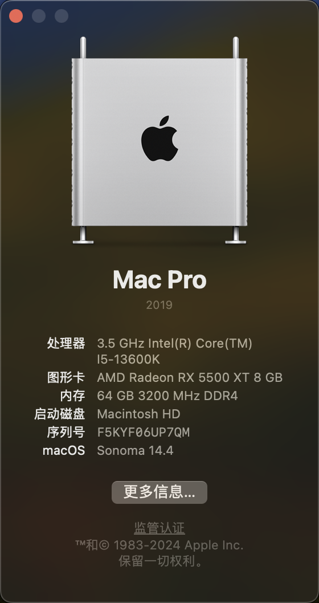

# Hackintosh I513600K-TUF_B660M_WIFI

Current Version: macOS Sonoma 14.4 (23E214)

Current OC Version: 0.9.9

## Hardware

| Hardware | Description |
|----------|-------------|
| CPU      | 13th Gen Intel(R) Core(TM) i5-13600K |
| Motherboard | ASUS TUF GAMING B660M-PLUS Wi-Fi D4 |
| GPU      | AMD Radeon RX 5500 XT 8 GB |
| RAM      | Corsair 3200MHz 16 GB * 4 |
| SSD      | KIOXIA-EXCERIA PLUS G2 1T PCIE 3.0 |
| Sound Card | Realtek-ALC897 + M-AUDIO M-Track Solo |
| Ethernet | Realtek-8125 Ethernet 2.5GbE |
| Wi-Fi / BT | Intel Wi-Fi 6 AX201 |

## Notes

iGPU UHD770 is **not supported** by macOS.

AMD Radeon RX 5500 XT 8 GB is **Free Drive**. You may need to configure your own GPU.

Hibernate / Sleep is **not working**.

Already fixed WiFi in Sonoma 14.4. (Untested in external WNICs)

### USB Mapping

Already mapped using [USBToolBox](https://github.com/USBToolBox/tool).

Due to the difference in each machine, you may need to remapping yourself.