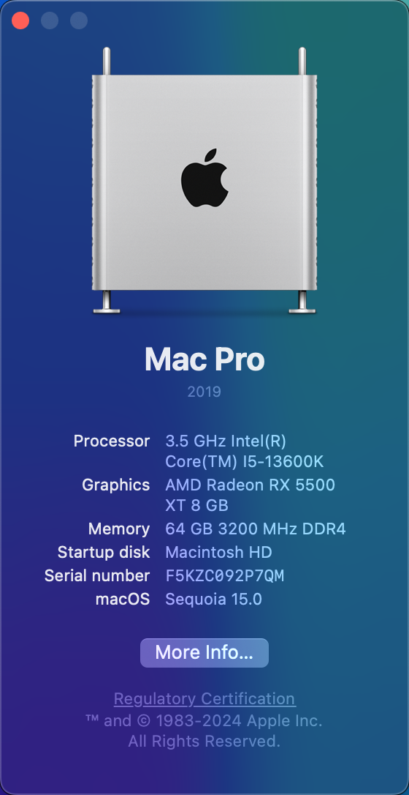

# Hackintosh I513600K-TUF_B660M_WIFI

Current Version: macOS Sonoma 14.5 (23F79)

Current OC Version: 1.0.0 Release

## Hardware

| Hardware | Description |
|----------|-------------|
| CPU      | 13th Gen Intel(R) Core(TM) i5-13600K |
| Motherboard | ASUS TUF GAMING B660M-PLUS Wi-Fi D4 |
| GPU      | AMD Radeon RX 5500 XT 8 GB |
| RAM      | Corsair 3200MHz 16 GB * 4 |
| SSD      | Western Digital WD Blue SN580 2TB |
| Sound Card | Realtek-ALC897 + M-AUDIO M-Track Solo |
| Ethernet | Realtek-8125 Ethernet 2.5GbE |
| Wi-Fi / BT | Intel Wi-Fi 6 AX201 |

## Notes

If you want to receive Delta Updates, ensure that you have enabled SIP.

Hibernate / Sleep is **working now**, but ensure that `hibernatemode` is set to `0`.

You can check `hibernatemode` using `pmset -g | grep hibernatemode`.

iGPU UHD770 is **unsupported** by macOS.

AMD Radeon RX 5500 XT 8 GB **driver-free**. You may need to configure your own GPU.

Already fixed WiFi / BT in Sonoma 14.5. (Untested in external WNICs)

### USB Mapping

Already mapped using [USBToolBox](https://github.com/USBToolBox/tool).

Due to the difference in each machine, you may need to remapping yourself.
